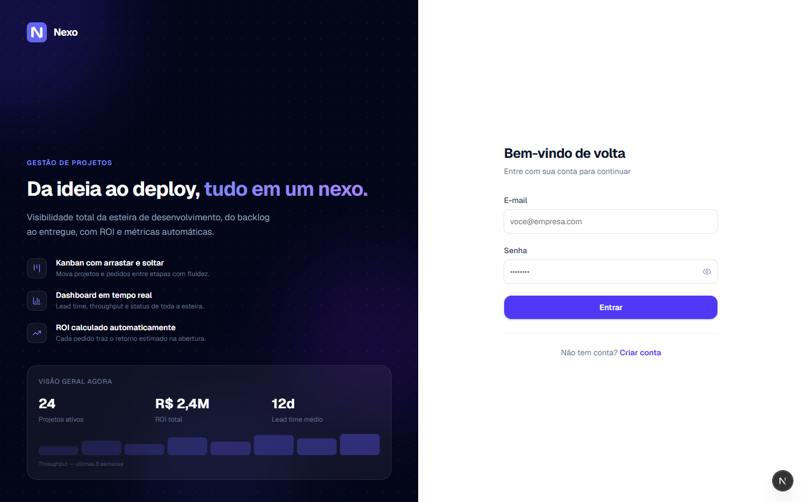
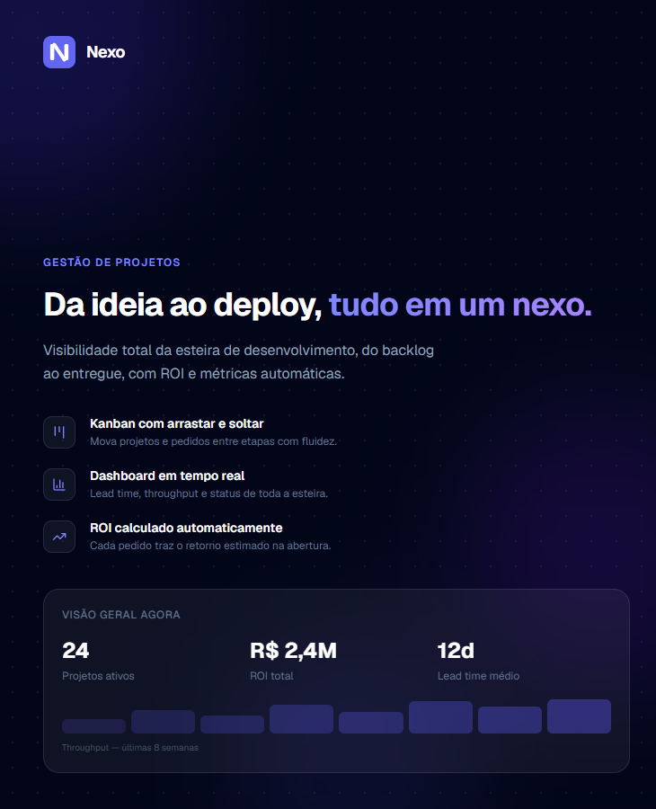

# Nexo — Gestão de Esteira de Desenvolvimento

Nexo é um SaaS de gestão de pipeline de desenvolvimento construído como projeto de portfólio. Demonstra a atuação de ponta a ponta de um **Product Engineer** — do discovery de produto à arquitetura técnica e deploy em produção.

> **Demo:** [nexo.vercel.app](https://nexo.vercel.app) — use as credenciais abaixo para explorar  
> `gestor@demo.com` / `demo1234` · `solicitante@demo.com` / `demo1234`

## Screenshots

| Login | Produto |
|---|---|
|  |  |

---

## O problema que resolve

Times de desenvolvimento sem visibilidade sobre suas demandas perdem tempo em triagem manual, não conseguem priorizar com dados e não sabem o retorno financeiro do que entregam. O Nexo centraliza pedidos, projetos e ROI em um único lugar.

## Funcionalidades

| Módulo | O que faz |
|---|---|
| **Pedidos** | Formulário orientado a valor — captura dados para calcular ROI automaticamente |
| **Projetos** | Visão lista + Kanban com drag-and-drop, filtros e ordenação |
| **Gantt** | Timeline visual de projetos com indicação de atraso |
| **Dashboard** | Métricas de throughput, lead time, WIP e status por setor |
| **ROI** | Tabela de retorno por projeto: custo dev × economia gerada × payback em meses |
| **Configurações** | Setores, times, status, prioridades, ROI e permissões por perfil (RBAC) |

## Decisões de produto

**Por que o formulário de pedido captura dados de processo?**  
Horas de desenvolvimento são estimadas pelo time, mas o valor de negócio precisa vir do solicitante. O formulário coleta custo atual do processo, redução esperada e pessoas impactadas — suficiente para calcular economia mensal sem exigir que o solicitante entenda de TI.

**Por que ROI por projeto e não por portfólio apenas?**  
Gestores precisam priorizar o próximo projeto, não só admirar o retorno agregado. Ver payback individual ("esse projeto se paga em 4 meses") torna a priorização objetiva.

**RBAC via RLS, não middleware**  
Permissões aplicadas diretamente no banco (Supabase Row Level Security) garantem que nem uma requisição maliciosa ao servidor pode contornar as regras — independente de bugs no frontend ou na API.

## Stack

- **Next.js 15** (App Router, React Server Components, Server Actions)
- **React 19** com `useActionState` e `useTransition`
- **TypeScript** strict mode
- **Tailwind CSS v4**
- **Supabase** — PostgreSQL + Auth + RLS
- **@base-ui/react** — componentes acessíveis sem opinião visual
- **date-fns** — manipulação de datas sem bundle pesado
- **Recharts** — gráficos do dashboard
- **Vercel** — deploy e edge functions

## Rodando localmente

```bash
git clone https://github.com/jeoncampregher-ops/nexo
cd nexo
npm install
```

Crie `.env.local`:

```env
NEXT_PUBLIC_SUPABASE_URL=sua_url_aqui
NEXT_PUBLIC_SUPABASE_ANON_KEY=sua_anon_key_aqui
```

Aplique o schema no SQL Editor do Supabase (`supabase/schema.sql`), depois:

```bash
npm run dev
```

Acesse [http://localhost:3000](http://localhost:3000).

## Estrutura do projeto

```
src/
├── app/
│   ├── (auth)/          # Login e registro
│   └── (app)/           # Dashboard, projetos, pedidos, Gantt, ROI, configurações
├── components/
│   ├── ui/              # Primitivos (Button, Input, Select, DatePicker…)
│   ├── projects/        # Modal, card e linha de projeto
│   ├── requests/        # Card de pedido
│   ├── kanban/          # Board e card genérico com DnD
│   ├── gantt/           # Timeline CSS Grid
│   ├── dashboard/       # Gráficos Recharts
│   ├── settings/        # Abas de configuração
│   └── layout/          # Sidebar e Header
├── lib/
│   ├── actions/         # Server Actions (projetos, pedidos, configurações)
│   ├── queries/         # Queries Supabase (server-side)
│   ├── supabase/        # client.ts + server.ts
│   ├── roi.ts           # Fórmulas de ROI
│   └── types.ts         # Tipos globais
└── middleware.ts         # Proteção de rotas via Supabase Auth
```

---

Construído por [Jean Campregher](https://linkedin.com/in/jeancampregher)
